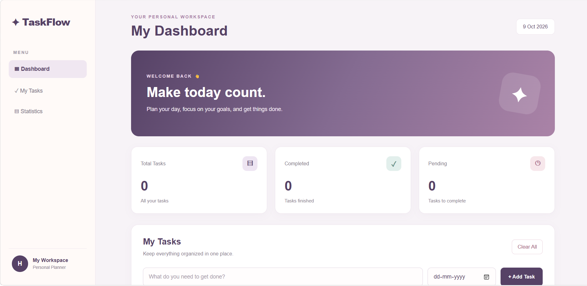

# ✦ TaskFlow — Todo Dashboard

A responsive and user-friendly Todo App built with HTML, CSS, and JavaScript to help users organize daily tasks, manage due dates, and track their productivity.

## 📸 Project Preview



## ✨ Features

- **Add Tasks:** Add new tasks with ease.
- **Due Dates:** Set a due date for each task.
- **Edit Tasks:** Update task names and due dates.
- **Complete Tasks:** Mark tasks as completed or undo them.
- **Delete Tasks:** Remove individual tasks.
- **Clear All:** Clear all tasks with confirmation.
- **Task Statistics:** View total, completed, and pending tasks.
- **Local Storage:** Tasks remain saved after refreshing or reopening the browser.
- **Responsive Design:** Works on desktop, tablet, and mobile screens.
- **Dashboard UI:** Full-page layout with sidebar navigation and task overview.

## 🛠️ Technologies Used

- HTML5
- CSS3
- JavaScript
- Browser LocalStorage

## 🎨 Design

TaskFlow features a clean dashboard interface with a pastel color palette of purple, mauve, soft pink, and sage teal. The layout is designed to provide a simple and organized task management experience.

## 🚀 Getting Started

### Prerequisites

A modern web browser and a code editor such as Visual Studio Code.

### 1. Clone the Repository

```bash
git clone https://github.com/hiral1609/todo-app.git
```

### 2. Open the Project Folder

```bash
cd todo-app
```

### 3. Run the Application

Open `index.html` in your browser.

You can also use the Live Server extension in Visual Studio Code.

## 📁 Project Structure

```text
todo-app/
├── index.html
├── style.css
├── script.js
├── README.md
└── screenshots/
    └── todo-app.png
```

## 💾 Data Storage

The application uses browser LocalStorage to save tasks locally. Tasks remain available after refreshing or reopening the browser, as long as the browser's stored site data is not cleared.

Currently, tasks are not synchronized between different browsers or devices.

## 🔮 Future Improvements

- User authentication and personal accounts
- Cloud database integration
- Task search and filtering
- Task priority levels
- Due-date reminders
- Dark mode

## 👩‍💻 Author

**Hiral Shah**

GitHub: [hiral1609](https://github.com/hiral1609)

Project Repository: [Todo App on GitHub](https://github.com/hiral1609/todo-app)

---

Made with HTML, CSS, and JavaScript.
